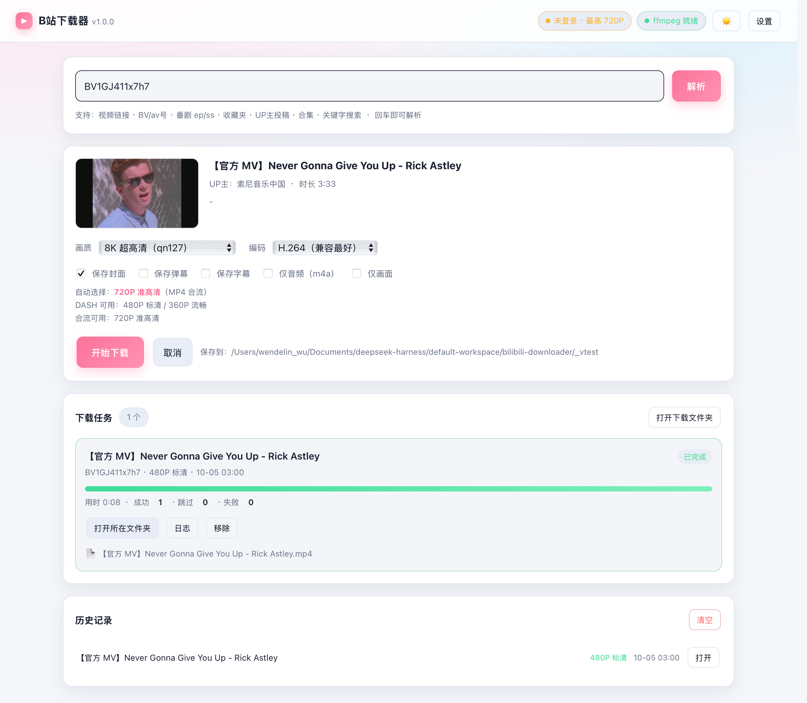

# bili-dl —— B 站视频下载器

一个用 **纯 Python 标准库** 实现的 B 站视频下载工具，自带**网页界面**和**命令行**两种用法。
不需要 `requests`、不需要 `yt-dlp`，只要系统里有 Python 3.8+ 就能跑。
项目自带 ffmpeg（在 `vendor/` 里），可以自动把 DASH 分离的音视频无损合并成 MP4
——不用往系统里装任何东西。

> 最省事的用法：双击 **`B站下载器.app`**（或 `启动下载器.command`），
> 浏览器会自动打开一个页面，粘贴链接 → 选画质 → 点下载。



```
   _     _ _ _        _ _
  | |__ (_) (_)      | | |
  | '_ \| | | |  ____| | |     B 站视频下载器
  | |_) | | | | |____| | |
  |_.__/|_|_|_|      |_|_|
```

---

## 一、功能特性

| 能力 | 说明 |
| --- | --- |
| 输入格式 | 视频链接 / `BV号` / `av号` / 番剧 `ep`·`ss` / 收藏夹 / UP主空间 / 合集 / 关键字搜索 |
| 分P支持 | 单P、指定分P（`-p 1,3-5`）、整季番剧、805 个分P的巨型合集都能处理 |
| 清晰度 | 360P ~ 8K，DASH 与 MP4 合流两种模式，**自动比较两条通道取更高画质** |
| 编码偏好 | `avc`（兼容最好）/ `hevc` / `av1`（体积最小）/ `best` |
| 多线程下载 | 文件按 8MB 分片，多线程并发拉取（`-j` 控制线程数） |
| 断点续传 | 中断后重新运行会读取分片清单，从断点继续，不重下已完成的块 |
| 自动合并 | 检测到 ffmpeg 时自动 `-c copy` 无损合并音视频；没有则保留原始流并打印合并命令 |
| 附加内容 | 封面、CC 字幕（转 SRT）、弹幕（转 XML）、`info.json` 元数据 |
| 批量抓取 | 收藏夹、UP主全部投稿、合集、搜索结果一次性批量下载，带限速保护 |
| 风控处理 | 自动获取 `buvid3/buvid4` 指纹、WBI 签名、失败重试、URL 过期自动刷新 |
| 网页界面 | 本地 Web app：粘贴链接、实时进度条、速度/剩余时间、任务队列、取消、断点续传、历史记录 |
| 双击启动 | 自带 `.app` 图标包和 `.command` 启动器，双击就能用，不用敲命令 |

---

## 二、环境要求

* **Python 3.8+** —— 除此之外零依赖
* **ffmpeg** —— 已经打包在项目的 `vendor/` 目录里，开箱即用

```bash
# 检查环境（在项目目录下执行）
python3 -V
python3 bili-dl.py BV1GJ411x7h7 --dry-run   # 会自动显示是否找到 ffmpeg
```

启动时的环境概览里，`ffmpeg` 一行会打印实际使用的路径。

**如果 `vendor/` 被删掉了、或者你想换用系统 ffmpeg**：

```bash
brew install ffmpeg                                              # 系统级（体积较大）
python3 -m pip install --target vendor imageio-ffmpeg            # 重新装到项目里
python3 bili-dl.py --install-ffmpeg                              # 让工具帮你装
python3 bili-dl.py --ffmpeg /path/to/ffmpeg <目标>                # 手动指定
```

工具的查找顺序是：`--ffmpeg` 参数 → 环境变量 `FFMPEG` → `PATH` 里的 ffmpeg →
`/opt/homebrew/bin`、`/usr/local/bin` 等常见位置 → 项目 `vendor/` 里的 imageio-ffmpeg。

没有 ffmpeg 时工具仍然可用，会自动退回 **MP4 合流**模式（音视频在同一个文件里，
无需合并），只是拿不到 1080P60 / 4K / HDR 这类必须走 DASH 的画质。

---

## 三、快速开始

### 方式一：网页界面（推荐）

在硬盘上双击任意一个：

* **`B站下载器.app`** —— 有图标，双击后自动打开终端 + 浏览器
* **`启动下载器.command`** —— 效果一样

或者在终端里手动启动：

```bash
cd /Volumes/1B的硬盘1/bilibili-downloader
python3 bili-dl.py --web
```

终端会打印出访问地址（形如 `http://127.0.0.1:8765/?token=xxxx`），浏览器会自动打开。
在页面里：

1. 把视频链接、`BV号`、收藏夹链接、UP主空间地址粘进输入框（也可以直接输入关键字搜索）；
2. 点「解析」，页面会显示标题、UP主、时长，以及**自动选择**会下哪个画质（还会列出 DASH / 合流两条通道各自可选的画质）；
3. 需要的话改画质、勾上封面/弹幕/字幕，点「开始下载」；
4. 任务卡片上会实时显示进度条、速度、剩余时间，可以随时取消或打开所在文件夹。

想退出：回到终端窗口按 `Control-C`，或直接关掉那个终端窗口。

### 方式二：命令行

```bash
cd /Volumes/1B的硬盘1/bilibili-downloader

python3 bili-dl.py --help                    # 全部参数
python3 bili-dl.py BV1GJ411x7h7              # 下单个视频
python3 bili-dl.py <链接> -o ~/影片 -q 1080p --cover --danmaku
python3 bili-dl.py BV1Dx411F7D1 -p 1,3-5     # 只下第 1、3、4、5 个分P
python3 bili-dl.py BV1GJ411x7h7 --dry-run    # 只看有哪些画质，不下载
```

也可以直接当模块跑：`python3 -m bili_dl <目标>`

---

## 三点五、网页界面详解

| 区域 | 说明 |
| --- | --- |
| 顶部状态 | 登录状态、ffmpeg 是否就绪、深浅色切换、设置 |
| 输入框 | 视频链接 / BV号 / av号 / 番剧 / 收藏夹 / UP主空间 / 合集 / 关键字搜索 |
| 解析结果 | 封面、标题、UP主、时长、分P数；画质与编码下拉；分P范围；封面/弹幕/字幕/仅音频/仅视频开关 |
| 画质提示 | 「自动选择」会下哪个画质，以及 DASH 与 MP4 合流两条通道各自可用的画质 |
| 下载任务 | 实时进度条、速度、剩余时间、取消、打开所在文件夹、展开日志、产出文件列表 |
| 历史记录 | 最近 300 条，可一键在访达里打开 |

**设置**（右上角）可以改下载目录、下载线程数、批量抓取上限，会保存到 `web_data/settings.json`。

**安全说明**：网页服务只监听 `127.0.0.1`，每次启动生成一次性随机 token，
所有接口都要带 token，并校验 `Host` 头（防 DNS rebinding）。
「打开文件夹」也只允许打开下载目录内的路径。也就是说，**只有本机能访问**。

**想要 1080P+ / 收藏夹 / 投稿列表 / 字幕**：在项目目录下建一个 `config.json`：

```json
{ "cookie": "SESSDATA=你的值" }
```

或者启动时加参数：`python3 bili-dl.py --web --cookie "SESSDATA=你的值"`

---

## 四、命令行参数

| 参数 | 说明 |
| --- | --- |
| `目标 ...` | 视频链接 / BV号 / av号 / 番剧链接 / 收藏夹链接 / UP主空间 / 合集 / 搜索词，可传多个 |
| `-o, --output DIR` | 输出目录（默认 `./downloads`） |
| `-q, --quality` | `best`/`8k`/`4k`/`1080p+`/`1080p`/`1080p60`/`720p`/`480p`/`360p`，或直接写 qn 值（如 `80`）。默认 `best` |
| `--codec` | `avc`（默认，兼容性最好）/ `hevc` / `av1`（同画质体积最小）/ `best`（码率最高） |
| `-p, --pages` | 只下载指定分P，如 `1,3-5` |
| `-j, --workers` | 每个文件的下载线程数（默认 8） |
| `--chunk-size` | 分片大小，单位 MB（默认 8） |
| `--audio-only` | 只下音频（输出 `.m4a`） |
| `--video-only` | 只下画面（无声音） |
| `--format` | `auto`（默认，两条通道都问一次、挑画质更高的）/ `dash`（强制分离流）/ `mp4`（强制合流） |
| `--cover` | 同时保存封面 |
| `--danmaku` | 同时保存弹幕 XML |
| `--subtitle` | 同时保存 CC 字幕（SRT，需登录） |
| `--no-metadata` | 不写 `.info.json` |
| `--cookie` | Cookie 字符串，如 `"SESSDATA=xxx; bili_jct=yyy"` |
| `--cookie-file` | 从文件读取 Cookie |
| `--config` | 指定 JSON 配置文件（默认自动找 `./config.json`） |
| `--ffmpeg` | 指定 ffmpeg 路径 |
| `--max-items` | 批量下载（收藏夹/投稿/合集/搜索）时的最大条数 |
| `--list FILE` | 从文本文件批量读取目标，每行一个，`#` 开头为注释 |
| `--search KW` | 直接按关键字搜索并下载 |
| `--flat` | 批量下载时不按合集名建子目录 |
| `--overwrite` | 覆盖已存在的文件 |
| `--keep-temp` | 保留临时文件 |
| `--dry-run` | 只列出可用画质和输出路径，不下载 |
| `-v, --verbose` | 输出调试信息 |
| `--web` | 启动网页界面（等价于双击那个 .app） |
| `--port` | 网页界面端口（默认 8765，被占用会自动顺延） |
| `--host` | 监听地址（默认 `127.0.0.1`，只允许本机） |
| `--no-browser` | 启动网页界面时不自动打开浏览器 |
| `--web-concurrency` | 网页界面同时下载的任务数（默认 2） |
| `--install-ffmpeg` | 用 pip 安装 imageio-ffmpeg 后退出 |

### 配置文件

复制 `config.example.json` 为 `config.json` 放在当前目录即可生效；
**命令行参数优先级高于配置文件**。

```json
{
  "output": "/Volumes/1B的硬盘1/bilibili缓存",
  "quality": "1080p",
  "codec": "avc",
  "workers": 8,
  "cookie": "SESSDATA=你的值; bili_jct=你的值",
  "cover": true,
  "danmaku": true
}
```

---

## 五、支持的目标与示例

```bash
# —— 单个视频 / 分P ——
python3 bili-dl.py BV1GJ411x7h7
python3 bili-dl.py av80433022
python3 bili-dl.py "https://www.bilibili.com/video/BV1GJ411x7h7?p=2"
python3 bili-dl.py BV1Dx411F7D1 -p 1,3-5

# —— 番剧 / 影视 ——
python3 bili-dl.py "https://www.bilibili.com/bangumi/play/ep826497"   # 单集
python3 bili-dl.py "https://www.bilibili.com/bangumi/play/ss47836"    # 整季

# —— 收藏夹（需要登录 Cookie）——
python3 bili-dl.py "https://space.bilibili.com/123456/favlist?fid=987654" --max-items 50

# —— UP 主全部投稿（需要登录 Cookie）——
python3 bili-dl.py "https://space.bilibili.com/946974/video" --max-items 20

# —— 合集 / 视频列表 ——
python3 bili-dl.py "https://space.bilibili.com/946974/channel/collectiondetail?sid=30652"

# —— 关键字搜索，前 10 个结果 ——
python3 bili-dl.py --search "线性代数" --max-items 10

# —— 批量文件 ——
cat > targets.txt <<'EOF'
# 一行一个
BV1GJ411x7h7
https://www.bilibili.com/video/BV1Dx411F7D1
EOF
python3 bili-dl.py --list targets.txt -o ~/影片
```

短链（`b23.tv/xxx`）会自动展开；不带链接的普通文字会被当成搜索关键字。

---

## 六、关于 Cookie 与清晰度

匿名访问能拿到 360P/480P/720P；**1080P 及以上、大会员画质、收藏夹、UP主投稿列表、
CC 字幕**都需要登录态。把自己的 Cookie 传给工具即可：

1. 浏览器登录 B 站，按 `F12` 打开开发者工具；
2. 切到 **Application（应用）→ Cookies → https://www.bilibili.com**；
3. 找到 `SESSDATA`，复制它的值（必填）；
   有 `bili_jct` 的话一并复制（可选）；
4. 用任意一种方式传入：

```bash
# 方式一：命令行
python3 bili-dl.py "https://space.bilibili.com/946974/video" \
  --cookie "SESSDATA=你的值; bili_jct=你的值"

# 方式二：写进文件
echo "SESSDATA=你的值; bili_jct=你的值" > cookie.txt
python3 bili-dl.py --cookie-file cookie.txt <目标>

# 方式三：环境变量
export BILI_COOKIE="SESSDATA=你的值"
python3 bili-dl.py <目标>

# 方式四：写进 config.json 的 "cookie" 字段（一劳永逸）
```

> Cookie 等同于你的账号密码，**不要**把它提交到 Git 或发给别人。
> `cookie.txt` / `config.json` 已经在 `.gitignore` 里排除。

各清晰度对应的 qn 值：`127`=8K `126`=杜比视界 `125`=HDR `120`=4K `116`=1080P60
`112`=1080P+ `80`=1080P `74`=720P60 `64`=720P `32`=480P `16`=360P `6`=240P

---

## 七、输出文件说明

单P视频：

```
downloads/
└── 【官方 MV】Never Gonna Give You Up - Rick Astley.mp4      视频
    【官方 MV】Never Gonna Give You Up - Rick Astley.jpg      封面（--cover）
    【官方 MV】Never Gonna Give You Up - Rick Astley.xml      弹幕（--danmaku）
    【官方 MV】Never Gonna Give You Up - Rick Astley.zh-CN.srt 字幕（--subtitle）
    【官方 MV】Never Gonna Give You Up - Rick Astley.info.json 元数据
```

多P视频会按标题建子目录，按 `P01`、`P02` 顺序排好：

```
downloads/
└── (总结备份) 全期刊+SP(增刊) 动心MTV_PV 合集/
    ├── P01 1期MTV 「人型电脑天使心」片头曲 → Let me be with you.mp4
    └── P02 1期MTV 「再造人 009」片头欣赏.mp4
```

批量下载（收藏夹/投稿/合集/搜索）会再多一层以来源命名的目录，如
`downloads/UP主_946974/...`；加 `--flat` 可以取消这一层。

**没有 ffmpeg 时的 DASH 输出**：会保留 `<名称>.video.m4s` 与 `<名称>.audio.m4s`
两个原始流，并在终端打印一条可直接复制的合并命令：

```bash
ffmpeg -i "xxx.video.m4s" -i "xxx.audio.m4s" -c copy "xxx.mp4"
```

---

## 八、断点续传

下载过程中每个分片完成后都会记录到 `<文件名>.parts.json`。中途 `Ctrl-C`
或断网后，重新执行**完全相同**的命令即可续传：

```
[信息] 视频流 断点续传：已完成 128.00MB/512.34MB
```

全部完成后 `.parts.json` 会自动删除。想从头再来，删掉目标文件与同目录下的
`.bili_tmp/` 即可。

---

## 九、常见问题

**Q：提示「HTTP 412」或「风控校验失败 -352」？**
收藏夹、UP主投稿列表等接口现在要求登录态。用 `--cookie` 传入 `SESSDATA` 即可
（见第六节）。另外降低 `--max-items` 或隔几分钟再试，避免请求过密。

**Q：为什么只能下到 720P？**
匿名账号的上限。登录 Cookie 可解锁 1080P；1080P60 / 4K / HDR 需要大会员账号。
另外 1080P 以上必须走 DASH 分离流，也就需要 ffmpeg 才能合并。

**Q：`--dry-run` 里显示的清晰度比实际下载的高？**
接口会返回「账号可购买的清晰度列表」，但不代表有权限。工具按「目标画质 → 实际
可用」自动降级，并在调试信息（`-v`）里说明。

**Q：为什么装了 ffmpeg，画质反而比不装时低？**
不会。`--format auto` 会把 DASH 和 MP4 合流两条通道都请求一次再比较，取画质更高
的那条。匿名状态下同一个视频确实可能出现「合流 720P、DASH 只有 480P」的情况，
这时工具会选合流。想看它选了哪条，加 `--dry-run` 或 `-v`。

**Q：下载到一半报 URL 过期？**
B 站播放地址带签名，约 2 小时过期。工具会在分片失败时自动重新请求播放地址并
重试该分片。

**Q：字幕是空的？**
CC 字幕需要登录，且只有 UP 主上传过字幕的视频才有。

**Q：搜索经常返回 0 条？**
B 站搜索接口本身会随机返回空结果（风控/AB 实验）。工具已内置最多 3 次重试和
旧接口兜底，仍为空时换个关键字再试即可。

**Q：能下载番剧/影视吗？**
免费内容可以（匿名 360P/480P 预览）。大会员专享内容需要对应权限的 Cookie，
且部分内容有地区限制。

---

## 十、项目结构

```
bilibili-downloader/
├── bili-dl.py                启动脚本
├── bili-dl                   命令行包装脚本（可选）
├── config.example.json       配置示例
├── requirements.txt          依赖说明（无第三方依赖）
├── README.md                 本文档
├── vendor/                   自带的 ffmpeg（imageio-ffmpeg，约 47MB，可删）
├── 启动下载器.command         双击启动网页界面
├── B站下载器.app/             双击启动的图标版（内含图标）
└── bili_dl/
    ├── __init__.py           版本号
    ├── __main__.py           python3 -m bili_dl 入口
    ├── cli.py                命令行解析与主流程
    ├── runner.py             下载调度（CLI 与网页界面共用）
    ├── parser.py             链接/ID 解析
    ├── api.py                B 站 Web API 封装
    ├── wbi.py                WBI 请求签名
    ├── session.py            HTTP 会话、重试、分片下载
    ├── downloader.py         码流选择、并发下载、合并、附加内容
    ├── danmaku.py            弹幕 protobuf → XML
    ├── utils.py              日志、进度条、文件名清洗
    └── web/
        ├── server.py         本地 HTTP 服务 + JSON 接口
        ├── jobs.py           任务队列、进度、取消、历史
        └── static/           前端页面（原生 HTML/CSS/JS，无 CDN，可离线）
```

---

## 十一、免责声明

本工具仅供**个人学习、研究与离线观看**使用。请遵守
[哔哩哔哩用户协议](https://www.bilibili.com/protocal/licence.html) 与《著作权法》，
不要用于批量转载、二次分发或任何商业用途。请尊重 UP 主与版权方的劳动成果，
喜欢的视频请到 B 站点赞投币。因使用本工具产生的一切后果由使用者自行承担。
